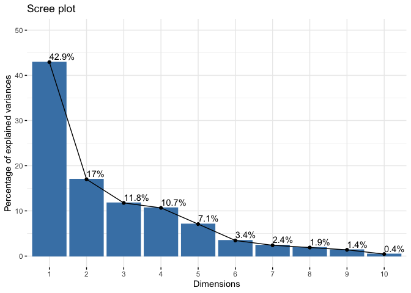
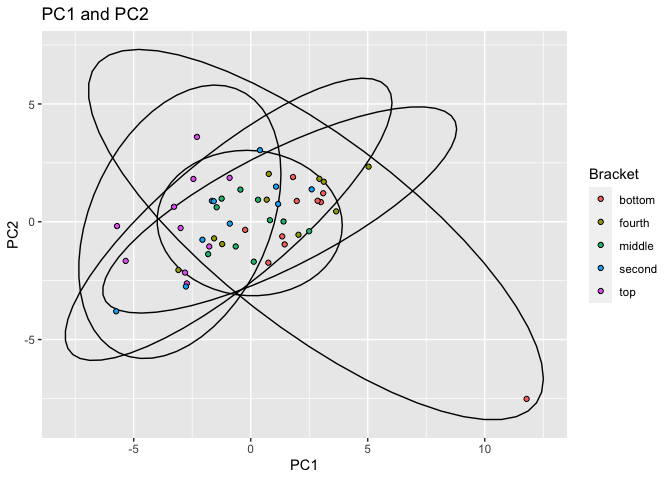

Exploratory Data Analysis on Tennis Stats
================
Rachel In rji245
3/22/2021

**In the setup chunk that is not shown in this report, I’ve already set
the libraries and installed packages that I used, including *tidyverse*,
*readxl*, *pastecs*, *kableExtra*, *psych*, and *factoextra*.**

### Description

*The two datasets I’ve chosen involve stats on the top 50 players in the
Women’s Tennis Association for 2019 since these stats may be more
accurate than the past year and a half due to COVID. One dataset
involves the service game stats and the other has return game stats. I
referred to the WTA Tennis website as well as a website called
*TennisAbstract* to collect and acquire the data. I’ve played tennis for
a good portion of my life and so I chose this topic. Tennis is a fun and
enjoyable sport that more people should know about, and I would like to
learn more about the game using these two datasets. The goal when
examining the datasets is to analyze their serve and return game stats
in order determine if certain factors may predict a player’s ranking or
win percentage as well as to see the comparisons between the top
players.*

------------------------------------------------------------------------

### Tidy and Join the two Datasets

**Before examining the data, I imported the two separate datasets I
found, one with service game stats and the other with return game stats,
and tidied them so that every observation had its own row and that every
variable had its own column.**

*To tidy, I changed the `Rank` variable to character, since it is an
ordinal variable, and also removed the `Player` column which was
essentially the same data as the `Name` column. Both datasets have 50
observations with no missing values in any of the columns. To merge, the
left, right, inner, and full join functions all give the same resulting
dataset, and so I just applied the inner join function, since its
purpose is to keep only matching rows between the tables. No
observations or columns were lost when merging the datasets.*

``` r
# import the two datasets from excel
# serve stats dataset
Serve_Stats <- read_excel("~/Documents/WTA Top 50 Serve Stats.xlsx", 
    # changed `Rank` to character variable
    col_types = c("text", "text", "text", 
        "text", "numeric", "numeric", "numeric", 
        "numeric", "numeric", "numeric", 
        "numeric", "numeric", "numeric", 
        "numeric", "numeric", "numeric"))
# return stats dataset
Return_Stats <- read_excel("~/Documents/WTA Top 50 Return Stats.xlsx", 
    # changed `Rank` to character variable
    col_types = c("text", "text", "text", 
        "numeric", "numeric", "numeric", 
        "numeric", "numeric", "numeric", 
        "numeric", "numeric", "numeric"))
View(Serve_Stats)
View(Return_Stats)

# tidy the datasets and create new dataset
wta_stats <- Serve_Stats %>%
  # separate to have every variable have its own column
  separate(player, into = c("Player","country"), sep = " ") %>%
  # remove repetitive variable
  select(-Player) %>%
  # join the two datasets
  inner_join(Return_Stats, by = "Rank") %>%
  # rearrange data
  select(Rank, Bracket, Name, everything())
head(wta_stats)
```

    ## # A tibble: 6 x 27
    ##   Rank  Bracket Name  country Hand  Height     M `M W` `M W Perc`   SPW  Aces
    ##   <chr> <chr>   <chr> <chr>   <chr> <chr>  <dbl> <dbl>      <dbl> <dbl> <dbl>
    ## 1 1     top     Ashl… AUS     right under     64    52      0.813 0.637   409
    ## 2 2     top     Naom… JPN     right above     51    40      0.784 0.621   351
    ## 3 3     top     Simo… ROU     right under     56    39      0.696 0.587    87
    ## 4 4     top     Sofi… USA     right under     70    48      0.686 0.599   137
    ## 5 5     top     Elin… UKR     right under     61    39      0.639 0.580   226
    ## 6 6     top     Karo… CZE     right above     67    51      0.761 0.629   488
    ## # … with 16 more variables: AcePerc <dbl>, DFs <dbl>, DFPerc <dbl>,
    ## #   `1stln` <dbl>, `1stPerc` <dbl>, `2ndPerc` <dbl>, HldPerc <dbl>, RPW <dbl>,
    ## #   `v1st%` <dbl>, `v2nd%` <dbl>, `Brk%` <dbl>, `BPSvd%` <dbl>, BPSaved <dbl>,
    ## #   BPvs <dbl>, Points <dbl>, `TPW%` <dbl>

------------------------------------------------------------------------

### Summary Statistics

#### Manipulate the dataset

**To explore the `wta_stats` dataset, all six core dplyr functions
(filter, select, arrange, group\_by, mutate, summarize) were used to
manipulate the dataset and can be seen below.**

``` r
# manipulate the dataset using core dplyr functions
wta_stats %>% 
  select(Rank, Name, Hand) %>%
  # filter to find only left-handed players
  filter(Hand == "left")
```

    ## # A tibble: 4 x 3
    ##   Rank  Name                Hand 
    ##   <chr> <chr>               <chr>
    ## 1 10    Petra Kvitova       left 
    ## 2 20    Marketa Vondrousova left 
    ## 3 26    Angelique Kerber    left 
    ## 4 41    Jil Belen Teichmann left

*The core dplyr functions `select` and `filter` were used here. The
table includes only the columns `Rank`, `Name`, and `Hand`, and only
keeps the observations of left-handed players. The players ranked 10,
20, 26, and 41 play with their left hand.*

``` r
wta_stats %>%
  # arrange the data by a variable
  arrange(desc(RPW)) %>% 
  # keep RPW and remove the other variables besides name and rank
  select(Rank, Name, RPW)
```

    ## # A tibble: 50 x 3
    ##    Rank  Name                  RPW
    ##    <chr> <chr>               <dbl>
    ##  1 20    Marketa Vondrousova 0.478
    ##  2 3     Simona Halep        0.476
    ##  3 9     Bianca Andreescu    0.472
    ##  4 15    Victoria Azarenka   0.466
    ##  5 32    Amanda Anisimova    0.466
    ##  6 7     Serena Williams     0.462
    ##  7 38    Barbora Krejcikova  0.46 
    ##  8 26    Angelique Kerber    0.458
    ##  9 17    Elise Mertens       0.457
    ## 10 5     Elina Svitolina     0.45 
    ## # … with 40 more rows

*The core dplyr functions `select` and `arrange` were used here. This
table organizes the values from greatest to least for the variable `RPW`
and only contains the three variables `Rank`, `Name`, and `RPW`. Marketa
Vondrousova had the highest proportion of return point wins with 0.478.*

``` r
wta_stats %>%
  # group by height and find means for each group
  group_by(Height) %>%
  summarize(mean_aces = mean(AcePerc))
```

    ## # A tibble: 2 x 2
    ##   Height mean_aces
    ## * <chr>      <dbl>
    ## 1 above     0.0551
    ## 2 under     0.0383

*The core dplyr functions `group_by` and `summarize` were used here. The
table shows the averages of the mean ace proportions for each category
for the variable `Height`. Those above 5’9" had the highest average of
the proportion of aces with 0.055.*

``` r
wta_stats %>% 
  # create new variable for average of aces per match
  mutate(average_ace = Aces/M) %>% 
  # keep only the names and the new column
  select(Name, average_ace) %>%
  # arrange values in descending order
  arrange(desc(average_ace))
```

    ## # A tibble: 50 x 2
    ##    Name                  average_ace
    ##    <chr>                       <dbl>
    ##  1 Karolina Pliskova            7.28
    ##  2 Naomi Osaka                  6.88
    ##  3 Madison Keys                 6.88
    ##  4 Serena Williams              6.65
    ##  5 Ashleigh Barty               6.39
    ##  6 Ekaterina Alexandrova        5.86
    ##  7 Kiki Bertens                 5.64
    ##  8 Veronika Kudermetova         4.90
    ##  9 Jennifer Brady               4.81
    ## 10 Petra Kvitova                4.74
    ## # … with 40 more rows

*The core dplyr functions `select` and `mutate` were used here. In this
table, a new variable `average_ace` which is the average number of aces
per match was created and added to the dataset, before only selecting
for the variables `Name` and `average_ace`. Karolina Pliskova had the
highest average number of aces per match, with about 7 aces per match.*

#### Summary statistics

**Summary statistics for the numeric variables both overall and after
grouping by a categorical variables.**

*I found some summary statistics for the numeric variables using the
package `pastecs`. The summary statistics include the number of
observations (nbr.val), some descriptive statistics (min, max, median,
mean, range), sum of values (sum), standard error mean (SE.mean),
confidence interval mean (CI.mean), variance (var), standard deviation
(std.dev) and the coefficient of variance (coef.var).*

``` r
# summary statistics for the numeric variables
sum_interm <- stat.desc(wta_stats) %>%
  select_if(is.numeric)
sum_stats <- sum_interm[-c(2,3), ] %>%
  t()
# visualize the summary stats
sum_stats
```

    ##          nbr.val     min       max     range        sum    median       mean
    ## M             50  25.000    81.000    56.000   2379.000   47.5000   47.58000
    ## M W           50  14.000    55.000    41.000   1500.000   28.0000   30.00000
    ## M W Perc      50   0.455     0.862     0.407     31.235    0.6090    0.62470
    ## SPW           50   0.488     0.646     0.158     29.208    0.5810    0.58416
    ## Aces          50   0.000   488.000   488.000   7822.000  135.0000  156.44000
    ## AcePerc       50   0.000     0.114     0.114      2.335    0.0425    0.04670
    ## DFs           50   7.000   350.000   343.000   7330.000  126.0000  146.60000
    ## DFPerc        50   0.024     0.084     0.060      2.310    0.0430    0.04620
    ## 1stln         50   0.538     0.726     0.188     31.108    0.6215    0.62216
    ## 1stPerc       50   0.564     0.752     0.188     32.758    0.6480    0.65516
    ## 2ndPerc       50   0.345     0.512     0.167     23.431    0.4770    0.46862
    ## HldPerc       50   0.444     0.801     0.357     34.657    0.6930    0.69314
    ## RPW           50   0.319     0.478     0.159     21.985    0.4410    0.43970
    ## v1st%         50   0.206     0.434     0.228     18.400    0.3715    0.36800
    ## v2nd%         50   0.501     0.624     0.123     27.896    0.5560    0.55792
    ## Brk%          50   0.125     0.457     0.332     17.828    0.3590    0.35656
    ## BPSvd%        50   0.375     0.650     0.275     28.264    0.5700    0.56528
    ## BPSaved       50   3.000   306.000   303.000   9298.000  193.0000  185.96000
    ## BPvs          50   8.000   519.000   511.000  16295.000  331.5000  325.90000
    ## Points        50 131.000 11590.000 11459.000 315037.000 6264.5000 6300.74000
    ## TPW%          50   0.427     0.551     0.124     25.600    0.5135    0.51200
    ##               SE.mean      CI.mean          var      std.dev   coef.var
    ## M        1.698520e+00 3.413304e+00 1.442486e+02 1.201035e+01 0.25242439
    ## M W      1.405238e+00 2.823932e+00 9.873469e+01 9.936533e+00 0.33121778
    ## M W Perc 1.381680e-02 2.776589e-02 9.545194e-03 9.769951e-02 0.15639428
    ## SPW      3.843400e-03 7.723601e-03 7.385861e-04 2.717694e-02 0.04652311
    ## Aces     1.565749e+01 3.146490e+01 1.225784e+04 1.107151e+02 0.70771634
    ## AcePerc  3.528687e-03 7.091162e-03 6.225816e-04 2.495159e-02 0.53429520
    ## DFs      1.176383e+01 2.364031e+01 6.919388e+03 8.318286e+01 0.56741376
    ## DFPerc   2.165782e-03 4.352302e-03 2.345306e-04 1.531439e-02 0.33148035
    ## 1stln    5.627655e-03 1.130920e-02 1.583525e-03 3.979353e-02 0.06396028
    ## 1stPerc  5.646842e-03 1.134775e-02 1.594341e-03 3.992920e-02 0.06094573
    ## 2ndPerc  4.224118e-03 8.488684e-03 8.921588e-04 2.986903e-02 0.06373827
    ## HldPerc  8.736833e-03 1.755732e-02 3.816613e-03 6.177874e-02 0.08912880
    ## RPW      3.253538e-03 6.538230e-03 5.292755e-04 2.300599e-02 0.05232201
    ## v1st%    4.448435e-03 8.939464e-03 9.894286e-04 3.145518e-02 0.08547604
    ## v2nd%    3.545833e-03 7.125618e-03 6.286465e-04 2.507282e-02 0.04493982
    ## Brk%     6.829358e-03 1.372411e-02 2.332007e-03 4.829085e-02 0.13543542
    ## BPSvd%   6.444681e-03 1.295107e-02 2.076696e-03 4.557077e-02 0.08061629
    ## BPSaved  9.199954e+00 1.848800e+01 4.231958e+03 6.505350e+01 0.34982522
    ## BPvs     1.536785e+01 3.088285e+01 1.180854e+04 1.086671e+02 0.33343697
    ## Points   3.240315e+02 6.511656e+02 5.249820e+06 2.291249e+03 0.36364753
    ## TPW%     2.484400e-03 4.992589e-03 3.086122e-04 1.756736e-02 0.03431126

*Since there are 21 numeric variables in the dataset, I chose only three
(M W Perc, RPW, and Brk%) to create summary statistics after grouping by
one of categorical variables.*

``` r
# summary stats of `M W Perc` grouped by categorical variable
bracket_mw <- wta_stats %>%
  select(Bracket, "M W Perc") %>% 
  group_by(Bracket) %>%
  summarize(mean_mw = mean(`M W Perc`),
            n_rows = n(),
            sd = sd(`M W Perc`),
            var = var(`M W Perc`),
            IQR = IQR(`M W Perc`),
            min = min(`M W Perc`), 
            max = max(`M W Perc`))
# put stats into table
kable(bracket_mw) %>% 
  kable_styling(bootstrap_options = "striped") %>%
  column_spec(1, bold = T)
```

<table class="table table-striped" style="margin-left: auto; margin-right: auto;">
<thead>
<tr>
<th style="text-align:left;">
Bracket
</th>
<th style="text-align:right;">
mean\_mw
</th>
<th style="text-align:right;">
n\_rows
</th>
<th style="text-align:right;">
sd
</th>
<th style="text-align:right;">
var
</th>
<th style="text-align:right;">
IQR
</th>
<th style="text-align:right;">
min
</th>
<th style="text-align:right;">
max
</th>
</tr>
</thead>
<tbody>
<tr>
<td style="text-align:left;font-weight: bold;">
bottom
</td>
<td style="text-align:right;">
0.5494
</td>
<td style="text-align:right;">
10
</td>
<td style="text-align:right;">
0.0519406
</td>
<td style="text-align:right;">
0.0026978
</td>
<td style="text-align:right;">
0.0920
</td>
<td style="text-align:right;">
0.487
</td>
<td style="text-align:right;">
0.617
</td>
</tr>
<tr>
<td style="text-align:left;font-weight: bold;">
fourth
</td>
<td style="text-align:right;">
0.6043
</td>
<td style="text-align:right;">
10
</td>
<td style="text-align:right;">
0.1037744
</td>
<td style="text-align:right;">
0.0107691
</td>
<td style="text-align:right;">
0.1000
</td>
<td style="text-align:right;">
0.500
</td>
<td style="text-align:right;">
0.862
</td>
</tr>
<tr>
<td style="text-align:left;font-weight: bold;">
middle
</td>
<td style="text-align:right;">
0.6007
</td>
<td style="text-align:right;">
10
</td>
<td style="text-align:right;">
0.0767710
</td>
<td style="text-align:right;">
0.0058938
</td>
<td style="text-align:right;">
0.0825
</td>
<td style="text-align:right;">
0.455
</td>
<td style="text-align:right;">
0.726
</td>
</tr>
<tr>
<td style="text-align:left;font-weight: bold;">
second
</td>
<td style="text-align:right;">
0.6325
</td>
<td style="text-align:right;">
10
</td>
<td style="text-align:right;">
0.0732367
</td>
<td style="text-align:right;">
0.0053636
</td>
<td style="text-align:right;">
0.1200
</td>
<td style="text-align:right;">
0.535
</td>
<td style="text-align:right;">
0.750
</td>
</tr>
<tr>
<td style="text-align:left;font-weight: bold;">
top
</td>
<td style="text-align:right;">
0.7366
</td>
<td style="text-align:right;">
10
</td>
<td style="text-align:right;">
0.0765567
</td>
<td style="text-align:right;">
0.0058609
</td>
<td style="text-align:right;">
0.1120
</td>
<td style="text-align:right;">
0.632
</td>
<td style="text-align:right;">
0.851
</td>
</tr>
</tbody>
</table>

*The table shows some summary statistics, including the mean, number of
rows, standard deviation, variance, IQR, minimum value, and maximum
value for the numeric variable `M W Perc` (percentage of matches won)
when grouped by the categorical variable `Bracket`. The table shows that
the mean of `M W Perc` increases when going from the bottom to the top
bracket and each bracket has 10 observations. Other statistics are also
found in the table.*

``` r
# summary stats of `RPW` grouped by categorical variable
hand_rpw <- wta_stats %>%
  select(Hand, "RPW") %>% 
  group_by(Hand) %>%
  summarize(mean_mw = mean(`RPW`),
            n_rows = n(),
            sd = sd(`RPW`),
            var = var(`RPW`),
            IQR = IQR(`RPW`),
            min = min(`RPW`), 
            max = max(`RPW`))
# put stats into table
kable(hand_rpw) %>% 
  kable_styling(bootstrap_options = "striped") %>%
  column_spec(1, bold = T)
```

<table class="table table-striped" style="margin-left: auto; margin-right: auto;">
<thead>
<tr>
<th style="text-align:left;">
Hand
</th>
<th style="text-align:right;">
mean\_mw
</th>
<th style="text-align:right;">
n\_rows
</th>
<th style="text-align:right;">
sd
</th>
<th style="text-align:right;">
var
</th>
<th style="text-align:right;">
IQR
</th>
<th style="text-align:right;">
min
</th>
<th style="text-align:right;">
max
</th>
</tr>
</thead>
<tbody>
<tr>
<td style="text-align:left;font-weight: bold;">
left
</td>
<td style="text-align:right;">
0.4527500
</td>
<td style="text-align:right;">
4
</td>
<td style="text-align:right;">
0.0195171
</td>
<td style="text-align:right;">
0.0003809
</td>
<td style="text-align:right;">
0.02425
</td>
<td style="text-align:right;">
0.435
</td>
<td style="text-align:right;">
0.478
</td>
</tr>
<tr>
<td style="text-align:left;font-weight: bold;">
right
</td>
<td style="text-align:right;">
0.4385652
</td>
<td style="text-align:right;">
46
</td>
<td style="text-align:right;">
0.0231187
</td>
<td style="text-align:right;">
0.0005345
</td>
<td style="text-align:right;">
0.01650
</td>
<td style="text-align:right;">
0.319
</td>
<td style="text-align:right;">
0.476
</td>
</tr>
</tbody>
</table>

*This table shows the same summary statistics as the previous table for
the numeric variable `RPW` (percentage of return points won) when
grouped by the categorical variable `Hand`. This table shows that the
means of `RPW` are relatively the same between left-handed and
right-handed players, and there are only 4 left-handed players compared
to 46 right-handed players in the dataset. The other statistics are also
found in the table.*

``` r
# summary stats of `Brk%` grouped by categorical variable
height_brk <- wta_stats %>%
  select(Height, "Brk%") %>% 
  group_by(Height) %>%
  summarize(mean_mw = mean(`Brk%`),
            n_rows = n(),
            sd = sd(`Brk%`),
            var = var(`Brk%`),
            IQR = IQR(`Brk%`),
            min = min(`Brk%`), 
            max = max(`Brk%`))
# put stats into table
kable(height_brk) %>% 
  kable_styling(bootstrap_options = "striped") %>%
  column_spec(1, bold = T)
```

<table class="table table-striped" style="margin-left: auto; margin-right: auto;">
<thead>
<tr>
<th style="text-align:left;">
Height
</th>
<th style="text-align:right;">
mean\_mw
</th>
<th style="text-align:right;">
n\_rows
</th>
<th style="text-align:right;">
sd
</th>
<th style="text-align:right;">
var
</th>
<th style="text-align:right;">
IQR
</th>
<th style="text-align:right;">
min
</th>
<th style="text-align:right;">
max
</th>
</tr>
</thead>
<tbody>
<tr>
<td style="text-align:left;font-weight: bold;">
above
</td>
<td style="text-align:right;">
0.35852
</td>
<td style="text-align:right;">
25
</td>
<td style="text-align:right;">
0.0340919
</td>
<td style="text-align:right;">
0.0011623
</td>
<td style="text-align:right;">
0.034
</td>
<td style="text-align:right;">
0.272
</td>
<td style="text-align:right;">
0.423
</td>
</tr>
<tr>
<td style="text-align:left;font-weight: bold;">
under
</td>
<td style="text-align:right;">
0.35460
</td>
<td style="text-align:right;">
25
</td>
<td style="text-align:right;">
0.0599243
</td>
<td style="text-align:right;">
0.0035909
</td>
<td style="text-align:right;">
0.035
</td>
<td style="text-align:right;">
0.125
</td>
<td style="text-align:right;">
0.457
</td>
</tr>
</tbody>
</table>

*This last table shows same summary statistics used in the previous
tables for the numeric variable `Brk%` (proportion of break points won)
when grouped by the categorical variable `Height` (above/equal/under
5’9“). Based on height, half of players in the top 50 are taller than
5’9”, and the proportion of break points won is relatively the same
across the three categories. More statistics can be found in the table.*

*Since there are too many numeric variables to fit in the figure, I used
only 6 numeric variables to show a correlation matrix to be able to see
each figure and correlation value clearly. The 6 numeric variables are
`M W Perc` (proportion of matches won), `SPW` (proportion of serve
points won), `1stln` (proportion of 1st serves in), `1stPerc`
(proportion of 1st serves won), `v1st%` (proportion of opponent first
serves won against), and `v2nd%` (proportion of opponent second serves
won against).*

``` r
# save dataset with only the 6 numeric variables
wta_num <- wta_stats %>%
  select_if(is.numeric) %>%
  select(c(3, 4, 9, 10, 14, 15))

# visualize correlation for the ten numeric variables
pairs.panels(wta_num, 
             method = "pearson", #correlation coefficient method
             hist.col = "light green", # color of the histograms
             smooth = FALSE, density = FALSE, ellipses = FALSE)
```

<!-- -->
*Within this correlation matrix, the two variables `SPW` (proportion of
service points won) and `1stPerc` (proportion of first serves won) have
the highest correlation, while `1stln` (proportion of first serves in)
and `v1st%` (proportion of wins against opponent first serve) have the
smallest correlation, looking at the magnitude and ignoring the sign of
the value. This may not be the same when all 21 numeric variables are
included.*

------------------------------------------------------------------------

### Visualizations (plots)

**A correlation heatmap was made for the numeric variables as well as
two additional plots using ggplot.**

*The heatmap shows the correlation between all the numeric variables,
with 21 variables on the x and y axis.*

``` r
# correlation heatmap for numerical variables
# scale the variables
wta <- wta_stats %>%
  select(-Rank, -Bracket, -Name, -Hand, -Height, -country) %>%
  scale %>%
  as.data.frame

# find the correlation among the different tennis stats
cor(wta, use = "pairwise.complete.obs") %>%
  as.data.frame %>%
  rownames_to_column %>%
  pivot_longer(-1, names_to = "other_var", values_to = "correlation") %>%
  ggplot(aes(rowname, other_var, fill=correlation)) +
  # heatmap with geom_tile
  geom_tile() +
  # change the scale to make the middle appear neutral
  scale_fill_gradient2(low="red",mid="white",high="blue") +
  # Give title and labels
  labs(title = "Correlation Heatmap for Serve and Return Game Stats", x = "variable 1", y = "variable 2") +
  theme(axis.text.x=element_text(angle=60, hjust=1))
```

<!-- -->

*For the correlation heatmap, I selected for and scaled only the numeric
variables before saving it as a data frame. Then, I visualized the
correlation by using a heatmap with geom\_tile. As seen in the heatmap,
the outer layer of the tiles has mostly negative correlations, while the
majority of the inner tiles seem to have positive correlation values.
There seem to be a few strong correlations with values close to 1, as
seen with the dark blue tiles, but no strong negative correlations with
magnitudes greater than 0.5.*

#### Additional plots

**The following are two additional plots made using ggplot.**

``` r
# second plot using ggplot
wta_stats %>% 
  # 3 variables (DFPerc, M W Perc, Hand)
  ggplot(aes(`DFPerc`, `M W Perc`)) +
  geom_point(aes(color=Hand)) + 
  # add labels
  labs(title = "Proportion of Matches Won based on Double Fault", x = "Double Fault prop.", y = "Matches Won prop.")
```

<!-- -->

*The first plot contains the variables `DFPerc` (double fault
percentage), `M W Perc` (matches won percentage), and `Hand` (playing
hand). After looking at the graph, those who had a higher percentage of
double faults did not win as many matches compared to those how won more
than 70% of their matches. However, the data was surprising in that
there were many players with lower double fault proportions whose
winning proportion were equal to or lower than those with a `DFPerc`
value around 0.08, since players generally have a higher chance of
winning if they don’t double fault often. I can’t tell much about the
relationship based on which hand the player plays with since there only
being four left-handed players, but there does not seem to be a
correlation.*

``` r
wta_stats %>% 
  # 3 different variables (Bracket, HldPerc, Height)
  ggplot(aes(x = Bracket, y = HldPerc, fill = Bracket)) +
  # create bar graph and display statistics using stat = "summary"
  geom_bar(stat="summary", fun="mean") +
  geom_errorbar(stat="summary", fun.data="mean_se") + 
  # facet using height variable
  facet_wrap(~Height) +
  # change x-axis labels
  theme(axis.text.x=element_text(angle=60, hjust=1)) + 
  # remove legend
  theme(legend.position = "none") +
  # add labels
  labs(title = "Hold Proportion based on Bracket and Height", x = "Bracket", y = "Hold Proportion")
```

<!-- -->

*The second plot contains the variables `Bracket` (placement in top 50),
`HldPerc` (proportion of service games won), and `Height` (under/above
5’9“). Looking at the bar graphs, the same pattern can be seen across
each category. The players in higher brackets are able to win their
service games at a higher percentage than those in lower brackets, which
makes sense. It also seems that players above 5’9” for the top three
brackets have slightly higher hold proportions than players under or
equal to 5’9" from the middle brackets up. The bottom two brackets seem
to look relatively the same across the heights. This could possibly be
explained by the fact that taller people generally have longer limbs in
which they can use to reach far balls easier. This and being able to
strike down on the ball better when they serve, due to their height,
could be used to explain their higher hold proportions.*

------------------------------------------------------------------------

### PCA

*PCA was performed on the numeric variables. Following the steps, the
data was prepared by removing the categorical variables and scaling the
data before using the function `prcomp()` to run the PCA.*

``` r
# only keep numeric variables and perform PCA
wta_pca <- wta_stats %>%
  select(-Rank, -Bracket, -Name, -Hand, -Height, -country) %>%
  # scale to 0 mean and unit variance (standardize)
  scale() %>%
  prcomp()

# create scree plot to visualize percentage of variances of each PC
fviz_eig(wta_pca, addlabels = TRUE, ylim = c(0, 50))
```

<!-- -->

``` r
# visualize eigenvalues and variances of the PCs in a table
get_eigenvalue(wta_pca)
```

    ##          eigenvalue variance.percent cumulative.variance.percent
    ## Dim.1  9.0152006800     42.929527047                    42.92953
    ## Dim.2  3.5692903280     16.996620610                    59.92615
    ## Dim.3  2.4709847636     11.766594113                    71.69274
    ## Dim.4  2.2414112158     10.673386742                    82.36613
    ## Dim.5  1.4867182649      7.079610785                    89.44574
    ## Dim.6  0.7241855173      3.448502463                    92.89424
    ## Dim.7  0.5022724743      2.391773687                    95.28602
    ## Dim.8  0.3976229474      1.893442607                    97.17946
    ## Dim.9  0.2908728825      1.385108964                    98.56457
    ## Dim.10 0.0930441272      0.443067272                    99.00763
    ## Dim.11 0.0835339945      0.397780926                    99.40542
    ## Dim.12 0.0425694164      0.202711506                    99.60813
    ## Dim.13 0.0370670216      0.176509627                    99.78464
    ## Dim.14 0.0210802043      0.100381925                    99.88502
    ## Dim.15 0.0070811220      0.033719628                    99.91874
    ## Dim.16 0.0069042500      0.032877381                    99.95162
    ## Dim.17 0.0036506219      0.017383914                    99.96900
    ## Dim.18 0.0033733724      0.016063678                    99.98506
    ## Dim.19 0.0018481313      0.008800625                    99.99386
    ## Dim.20 0.0008423864      0.004011364                    99.99787
    ## Dim.21 0.0004462781      0.002125134                   100.00000

*To determining to the number of principle components to use, I made a
scree plot and found the eigenvalues greater than 1. The cumulative
variance of the five components is 89.5% and 59.9% for the first two
PCs. After considering the scree plot, the eigenvalues, and the
cumulative variance, I chose to keep/consider five principle
components.*

``` r
# Visualize both variables and individuals in the same graph
fviz_pca_biplot(wta_pca)
```

<!-- -->

*The biplot function can be used to interpret the principle components.
It shows each individual player, the numeric variables, and the first
two principle components PC1 and PC2. Although the text for the arrows
are a bit difficult to read due to the overlapping, we can interpret
from the plot that as PC1 increases, most of the variables will have
lower values except for the variables `1stln` and `v2nd%` which will
have higher proportion values. The variable `DFPerc` will not differ
very much. When PC2 increases, the values for variables such as `DFPerc`
and `M` will decrease while variables such as `Brk%` and `RPW` will
increase. Variables such as `1stPerc` and `v2nd%` will not really show
much of a difference when increasing PC2. However, since this graph is
not the best for seeing the patterns in the data, the `cor()` function
can be also be used to interpret the principle components. For example,
the variable `M` decreases when PC1 increases and also decreases when
PC2 increases, both due to the negative correlation.*

``` r
# save x as a data frame (PC scores for every observation)
pca_x <- as.data.frame(wta_pca[["x"]])

# attach the first five PCs to wta_stats and save as new data frame
wta_pc <- wta_stats %>%
  cbind(pca_x[,1:5])

# visualize the correlation between the variables and PCs
cor(wta_pc[, 7:27], wta_pc[,28:32])
```

    ##                 PC1         PC2         PC3          PC4          PC5
    ## M        -0.6314344 -0.62178071  0.19511445 -0.083261115  0.235516477
    ## M W      -0.7128406 -0.40661033 -0.03300693 -0.296451412  0.328302256
    ## M W Perc -0.4456351  0.20551539 -0.41451848 -0.605696618  0.350866950
    ## SPW      -0.8814470  0.20146896 -0.34510630  0.112917875  0.061976794
    ## Aces     -0.8165935 -0.33228762 -0.32954265  0.063002272 -0.085584190
    ## AcePerc  -0.6926333 -0.02644186 -0.60242683  0.084153804 -0.273119726
    ## DFs      -0.6976818 -0.47506717  0.35361088 -0.227846149 -0.211014342
    ## DFPerc   -0.0492954 -0.53922843  0.06705042 -0.585903243 -0.440797538
    ## 1stln     0.3449276  0.15220614  0.14988865 -0.153028421  0.812461356
    ## 1stPerc  -0.8483304 -0.02818492 -0.46561225 -0.025602385 -0.174739640
    ## 2ndPerc  -0.5171552  0.43800776  0.12626757  0.476031415  0.002173199
    ## HldPerc  -0.9033060  0.21674529 -0.27059732  0.090221726  0.115245485
    ## RPW      -0.4342233  0.70437685  0.40108247 -0.336462221 -0.128711152
    ## v1st%    -0.4601228  0.70030668  0.40563327 -0.002640185 -0.148661834
    ## v2nd%     0.2153059 -0.02787948 -0.02748089 -0.863032626  0.016004599
    ## Brk%     -0.4569350  0.63202521  0.44732710 -0.361051028 -0.178669569
    ## BPSvd%   -0.6653554  0.24572497 -0.16706504  0.057786637  0.279857813
    ## BPSaved  -0.7525947 -0.34689095  0.45935200  0.183502452  0.099906500
    ## BPvs     -0.7025397 -0.33761819  0.56218773  0.191711279  0.048716698
    ## Points   -0.8389061 -0.34530808  0.35629286  0.121802418  0.100492072
    ## TPW%     -0.8444953  0.49336892 -0.05695794 -0.157833474 -0.015407792

**Visualization of PCA**

*I plotted the two principle components PC1 and PC2 using ggplot since
they explain about 60% of the variance in the data.*

``` r
# visualize the new variables using ggplot based on PC1 and PC2
wta_pc %>%
  ggplot(aes(PC1, PC2, color = Bracket, fill = Bracket)) +
  stat_ellipse(type = "norm", color = "black") +
  geom_point(shape = 21, color = "black") +
  labs(title = "PC1 and PC2")
```

<!-- -->

*Looking at this PCA plot, there seems to be no significant pattern seen
between the five brackets dividing up the top 50 players based on the
numeric variables as they all seem to overlap quite a lot. There may be
a pattern if the observations were increased for there to be more
comparison and to have more in each of the brackets or possibly by just
decreasing the number of brackets.*

------------------------------------------------------------------------

#### References

<https://www.wtatennis.com/stats/2019> and
<http://www.tennisabstract.com/cgi-bin/leaders_wta.cgi?f=A2019qqs00w1>
