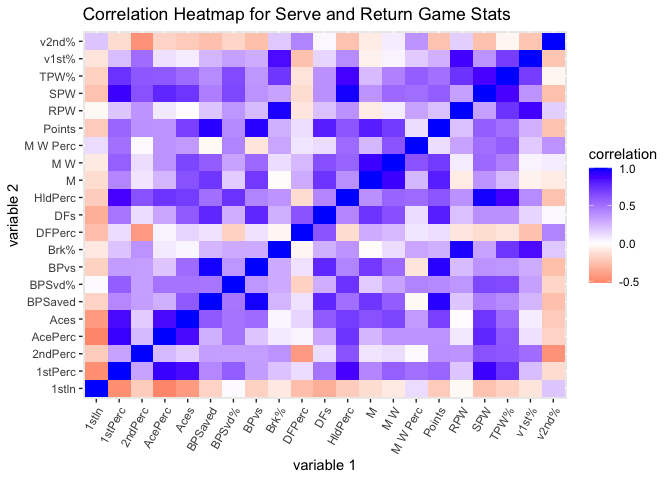
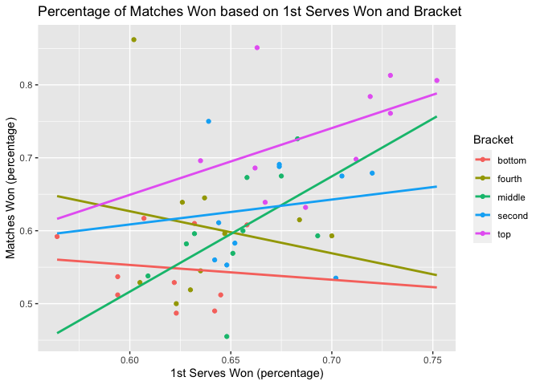
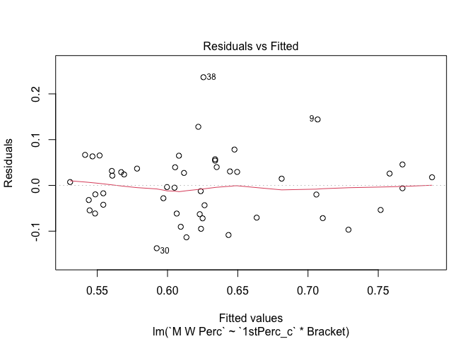
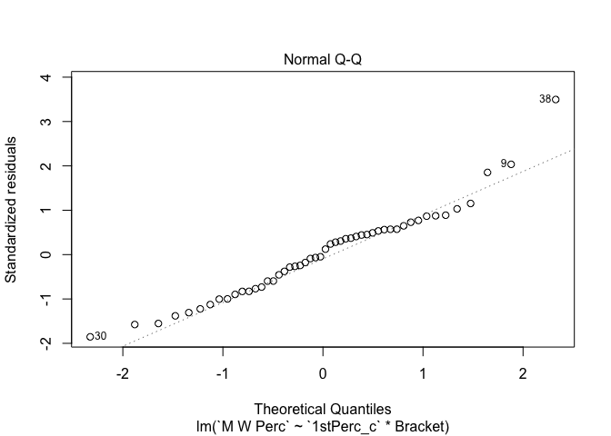
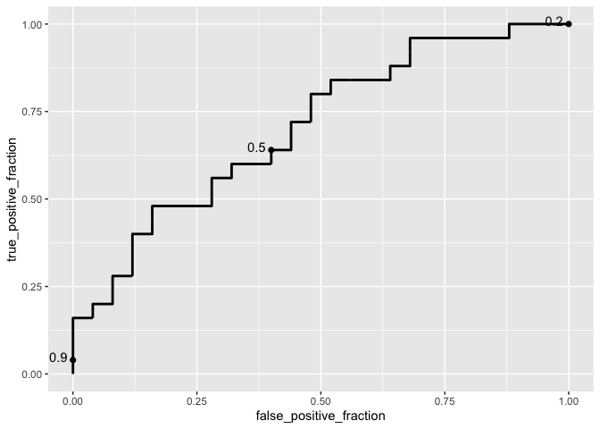

Modeling of Tennis Stats
================
Rachel In rji245
4/21/2021

**In the setup chunk that is not shown in this report, I’ve already set
the libraries and installed packages that I used, including *tidyverse*,
*readxl*, *psych*, *sandwich*, *lmtest*, *pastecs*, and *plotROC*.**

### Introduction

*The two datasets I’ve chosen involve stats on the top 50 players in the
Women’s Tennis Association for 2019 since these stats may be more
accurate than the past year and a half due to COVID. One dataset
involves the service game stats and the other has return game stats. I
referred to the WTA Tennis website as well as a website called
*TennisAbstract* to collect and acquire the data. I’ve played tennis for
a good portion of my life and so I chose this topic. I did have to tidy
the data to remove some repetitive columns as well as separate values
within a column. Tennis is a fun and enjoyable sport that more people
should know about, and I’m interested in learning more about the game
using these two datasets. When examining the dataset, I’m hoping to
determine some factors that may predict a player’s ranking or win
percentage or gives certain advantages for different components of the
game.*

``` r
# impport datasets from excel
# serve stats dataset
Serve_Stats <- read_excel("~/Documents/WTA Top 50 Serve Stats.xlsx", 
    col_types = c("text", "text", "text", 
        "text", "numeric", "numeric", "numeric", 
        "numeric", "numeric", "numeric", 
        "numeric", "numeric", "numeric", 
        "numeric", "numeric", "numeric"))
# return stats dataset
Return_Stats <- read_excel("~/Documents/WTA Top 50 Return Stats.xlsx", 
    # changed `Rank` to character variable
    col_types = c("text", "text", "text", 
        "numeric", "numeric", "numeric", 
        "numeric", "numeric", "numeric", 
        "numeric", "numeric", "numeric"))

# tidy the datasets and merge to create new dataset
wta_stats <- Serve_Stats %>%
  # separate to have every variable have its own column
  separate(player, into = c("Player","country"), sep = " ") %>%
  # remove repetitive variable
  select(-Player) %>%
  # join the two datasets
  inner_join(Return_Stats, by = "Rank") %>%
  # rearrange data
  select(Rank, Bracket, Name, everything()) %>%
  as.data.frame()
head(wta_stats)
```

    ##   Rank Bracket              Name country  Hand Height  M M W M W Perc   SPW
    ## 1    1     top    Ashleigh Barty     AUS right  under 64  52    0.813 0.637
    ## 2    2     top       Naomi Osaka     JPN right  above 51  40    0.784 0.621
    ## 3    3     top      Simona Halep     ROU right  under 56  39    0.696 0.587
    ## 4    4     top       Sofia Kenin     USA right  under 70  48    0.686 0.599
    ## 5    5     top   Elina Svitolina     UKR right  under 61  39    0.639 0.580
    ## 6    6     top Karolina Pliskova     CZE right  above 67  51    0.761 0.629
    ##   Aces AcePerc DFs DFPerc 1stln 1stPerc 2ndPerc HldPerc   RPW v1st% v2nd%  Brk%
    ## 1  409   0.092 198  0.044 0.577   0.729   0.512   0.797 0.441 0.388 0.529 0.367
    ## 2  351   0.098  97  0.027 0.609   0.719   0.469   0.778 0.439 0.373 0.547 0.348
    ## 3   87   0.023 138  0.037 0.692   0.635   0.479   0.698 0.476 0.415 0.575 0.443
    ## 4  137   0.026 278  0.052 0.654   0.662   0.480   0.742 0.429 0.334 0.575 0.342
    ## 5  226   0.050 183  0.041 0.603   0.667   0.448   0.697 0.450 0.371 0.576 0.391
    ## 6  488   0.099 209  0.043 0.656   0.729   0.439   0.787 0.439 0.367 0.562 0.354
    ##   BPSvd% BPSaved BPvs Points  TPW%
    ## 1  0.612     227  371   9046 0.538
    ## 2  0.610     192  315   7084 0.531
    ## 3  0.525     198  377   7702 0.529
    ## 4  0.600     306  510  10483 0.515
    ## 5  0.557     253  454   9021 0.515
    ## 6  0.623     276  443   9935 0.533

------------------------------------------------------------------------

### EDA

*To investigate the relationships between the variables that are going
to be tested later on as well as those in the regression models, I
created a correlation matrix with univariate/bivariate graphs including
the correlation coefficients. I included 8 numeric variables and 2
categorical variables.*

``` r
# save dataset with only variables investigating
wta_num <- wta_stats %>%
  select(c(2, 6, 9, 11, 16, 17, 18, 20, 21, 23))

# visualize correlation for the ten numeric variables
pairs.panels(wta_num, 
             method = "pearson", #correlation coefficient method
             hist.col = "light green", # color of the histograms
             smooth = FALSE, density = FALSE, ellipses = FALSE)
```

<!-- -->

*Within this correlation matrix, the two variables HldPerc (hold
proportion) and 1stPerc (proportion of first serves won) have the
highest correlation, while Height (above or under 5’9") and 2ndPerc
(proportion of second serves won) have the smallest correlation, looking
at the magnitude and ignoring the sign of the value. This may not be the
same when all 21 numeric variables are included.*

``` r
# correlation heatmap for numerical variables # scale the variables
wta <- wta_stats %>%
  select(-Rank, -Bracket, -Name, -Hand, -Height, -country) %>%
  scale %>%
  as.data.frame

# find the correlation among the different tennis stats
cor(wta, use = "pairwise.complete.obs") %>%
  as.data.frame %>%
  rownames_to_column %>%
  pivot_longer(-1, names_to = "other_var", values_to = "correlation") %>%
  ggplot(aes(rowname, other_var, fill=correlation)) +
  # heatmap with geom_tile
  geom_tile() +
  # change the scale to make the middle appear neutral
  scale_fill_gradient2(low="red",mid="white",high="blue") +
  # Give title and labels
  labs(title = "Correlation Heatmap for Serve and Return Game Stats", x = "variable 1",
 y = "variable 2") +
  theme(axis.text.x=element_text(angle=60, hjust=1))
```

<!-- --> *For the
correlation heatmap, I selected for and scaled only the numeric
variables before saving it as a data frame. Then, I visualized the
correlation by using a heatmap with geom\_tile. As seen in the heatmap,
the outer layer of the tiles has mostly negative correlations, while the
majority of the inner tiles seem to have positive correlation values.
There seem to be a few strong correlations with values close to 1, as
seen with the dark blue tiles, but no strong negative correlations with
magnitudes greater than 0.5.*

#### Summary Statistics

*I found some summary statistics for the numeric variables using the
package pastecs . The summary statistics include the number of
observations (nbr.val), some descriptive statistics (min, max, median,
mean, range), sum of values (sum), standard error mean (SE.mean),
confidence interval mean (CI.mean), variance (var), standard deviation
(std.dev) and the coefficient of variance (coef.var).*

``` r
# summary statistics for the numeric variables
sum_interm <- stat.desc(wta_stats) %>%
  select_if(is.numeric)
sum_stats <- sum_interm[-c(2,3), ] %>%
  t()
# visualize the summary stats
sum_stats
```

    ##          nbr.val     min       max     range        sum    median       mean
    ## M             50  25.000    81.000    56.000   2379.000   47.5000   47.58000
    ## M W           50  14.000    55.000    41.000   1500.000   28.0000   30.00000
    ## M W Perc      50   0.455     0.862     0.407     31.235    0.6090    0.62470
    ## SPW           50   0.488     0.646     0.158     29.208    0.5810    0.58416
    ## Aces          50   0.000   488.000   488.000   7822.000  135.0000  156.44000
    ## AcePerc       50   0.000     0.114     0.114      2.335    0.0425    0.04670
    ## DFs           50   7.000   350.000   343.000   7330.000  126.0000  146.60000
    ## DFPerc        50   0.024     0.084     0.060      2.310    0.0430    0.04620
    ## 1stln         50   0.538     0.726     0.188     31.108    0.6215    0.62216
    ## 1stPerc       50   0.564     0.752     0.188     32.758    0.6480    0.65516
    ## 2ndPerc       50   0.345     0.512     0.167     23.431    0.4770    0.46862
    ## HldPerc       50   0.444     0.801     0.357     34.657    0.6930    0.69314
    ## RPW           50   0.319     0.478     0.159     21.985    0.4410    0.43970
    ## v1st%         50   0.206     0.434     0.228     18.400    0.3715    0.36800
    ## v2nd%         50   0.501     0.624     0.123     27.896    0.5560    0.55792
    ## Brk%          50   0.125     0.457     0.332     17.828    0.3590    0.35656
    ## BPSvd%        50   0.375     0.650     0.275     28.264    0.5700    0.56528
    ## BPSaved       50   3.000   306.000   303.000   9298.000  193.0000  185.96000
    ## BPvs          50   8.000   519.000   511.000  16295.000  331.5000  325.90000
    ## Points        50 131.000 11590.000 11459.000 315037.000 6264.5000 6300.74000
    ## TPW%          50   0.427     0.551     0.124     25.600    0.5135    0.51200
    ##               SE.mean      CI.mean          var      std.dev   coef.var
    ## M        1.698520e+00 3.413304e+00 1.442486e+02 1.201035e+01 0.25242439
    ## M W      1.405238e+00 2.823932e+00 9.873469e+01 9.936533e+00 0.33121778
    ## M W Perc 1.381680e-02 2.776589e-02 9.545194e-03 9.769951e-02 0.15639428
    ## SPW      3.843400e-03 7.723601e-03 7.385861e-04 2.717694e-02 0.04652311
    ## Aces     1.565749e+01 3.146490e+01 1.225784e+04 1.107151e+02 0.70771634
    ## AcePerc  3.528687e-03 7.091162e-03 6.225816e-04 2.495159e-02 0.53429520
    ## DFs      1.176383e+01 2.364031e+01 6.919388e+03 8.318286e+01 0.56741376
    ## DFPerc   2.165782e-03 4.352302e-03 2.345306e-04 1.531439e-02 0.33148035
    ## 1stln    5.627655e-03 1.130920e-02 1.583525e-03 3.979353e-02 0.06396028
    ## 1stPerc  5.646842e-03 1.134775e-02 1.594341e-03 3.992920e-02 0.06094573
    ## 2ndPerc  4.224118e-03 8.488684e-03 8.921588e-04 2.986903e-02 0.06373827
    ## HldPerc  8.736833e-03 1.755732e-02 3.816613e-03 6.177874e-02 0.08912880
    ## RPW      3.253538e-03 6.538230e-03 5.292755e-04 2.300599e-02 0.05232201
    ## v1st%    4.448435e-03 8.939464e-03 9.894286e-04 3.145518e-02 0.08547604
    ## v2nd%    3.545833e-03 7.125618e-03 6.286465e-04 2.507282e-02 0.04493982
    ## Brk%     6.829358e-03 1.372411e-02 2.332007e-03 4.829085e-02 0.13543542
    ## BPSvd%   6.444681e-03 1.295107e-02 2.076696e-03 4.557077e-02 0.08061629
    ## BPSaved  9.199954e+00 1.848800e+01 4.231958e+03 6.505350e+01 0.34982522
    ## BPvs     1.536785e+01 3.088285e+01 1.180854e+04 1.086671e+02 0.33343697
    ## Points   3.240315e+02 6.511656e+02 5.249820e+06 2.291249e+03 0.36364753
    ## TPW%     2.484400e-03 4.992589e-03 3.086122e-04 1.756736e-02 0.03431126

*To give an example of some summary statistics of a numeric variable
grouped by a categorical variable, I used the variables *v1st%* and
*Bracket*.*

``` r
# summary stats of `v1st%` grouped by categorical variable
bracket_v1 <- wta_stats %>%
  select(Bracket, "v1st%") %>%
  group_by(Bracket) %>%
  summarize(mean_v1 = mean(`v1st%`),
            n_rows = n(),
            sd = sd(`v1st%`),
            var = var(`v1st%`),
            IQR = IQR(`v1st%`),
            min = min(`v1st%`),
            max = max(`v1st%`))
# put stats into table
kable(bracket_v1) %>%
  kable_styling(bootstrap_options = "striped") %>%
  column_spec(1, bold = T)
```

<table class="table table-striped" style="margin-left: auto; margin-right: auto;">
<thead>
<tr>
<th style="text-align:left;">
Bracket
</th>
<th style="text-align:right;">
mean\_v1
</th>
<th style="text-align:right;">
n\_rows
</th>
<th style="text-align:right;">
sd
</th>
<th style="text-align:right;">
var
</th>
<th style="text-align:right;">
IQR
</th>
<th style="text-align:right;">
min
</th>
<th style="text-align:right;">
max
</th>
</tr>
</thead>
<tbody>
<tr>
<td style="text-align:left;font-weight: bold;">
bottom
</td>
<td style="text-align:right;">
0.3523
</td>
<td style="text-align:right;">
10
</td>
<td style="text-align:right;">
0.0583915
</td>
<td style="text-align:right;">
0.0034096
</td>
<td style="text-align:right;">
0.02325
</td>
<td style="text-align:right;">
0.206
</td>
<td style="text-align:right;">
0.394
</td>
</tr>
<tr>
<td style="text-align:left;font-weight: bold;">
fourth
</td>
<td style="text-align:right;">
0.3709
</td>
<td style="text-align:right;">
10
</td>
<td style="text-align:right;">
0.0156379
</td>
<td style="text-align:right;">
0.0002445
</td>
<td style="text-align:right;">
0.02400
</td>
<td style="text-align:right;">
0.347
</td>
<td style="text-align:right;">
0.394
</td>
</tr>
<tr>
<td style="text-align:left;font-weight: bold;">
middle
</td>
<td style="text-align:right;">
0.3703
</td>
<td style="text-align:right;">
10
</td>
<td style="text-align:right;">
0.0138006
</td>
<td style="text-align:right;">
0.0001905
</td>
<td style="text-align:right;">
0.01450
</td>
<td style="text-align:right;">
0.347
</td>
<td style="text-align:right;">
0.391
</td>
</tr>
<tr>
<td style="text-align:left;font-weight: bold;">
second
</td>
<td style="text-align:right;">
0.3710
</td>
<td style="text-align:right;">
10
</td>
<td style="text-align:right;">
0.0259957
</td>
<td style="text-align:right;">
0.0006758
</td>
<td style="text-align:right;">
0.01925
</td>
<td style="text-align:right;">
0.341
</td>
<td style="text-align:right;">
0.434
</td>
</tr>
<tr>
<td style="text-align:left;font-weight: bold;">
top
</td>
<td style="text-align:right;">
0.3755
</td>
<td style="text-align:right;">
10
</td>
<td style="text-align:right;">
0.0224710
</td>
<td style="text-align:right;">
0.0005049
</td>
<td style="text-align:right;">
0.02150
</td>
<td style="text-align:right;">
0.334
</td>
<td style="text-align:right;">
0.415
</td>
</tr>
</tbody>
</table>

*This table includes some summary statistics such as the mean, number of
rows, standard deviation, variance, IQR, minimum value, and maximum
value for the numeric variable *v1st%* (percentage of first returns won)
when grouped by the categorical variable *Bracket* . Based on the table,
the mean of *v1st%* increases when going from the bottom to the top
bracket, as well as with the standard deviation and variance. Also, each
bracket has 10 observations. Other statistics are also found in the
table.*

------------------------------------------------------------------------

### MANOVA

*A one-way MANOVA was conducted to determine whether a subset of the
data’s numeric variables show a mean difference across the levels of the
categorical variable `Bracket`. The null hypothesis is that, for each of
the numeric variables, the means are the same across the ranking
brackets. The alternative hypothesis is that, for at least one of the
numeric variables, the group means differ.*

``` r
# Perform MANOVA with 6 response variables listed in cbind()
manova_wta <- manova(cbind(`1stPerc`, `2ndPerc`, `HldPerc`, `v1st%`, `v2nd%`, `M W Perc`) ~ Bracket, data = wta_stats)
manova_wta
```

    ## Call:
    ##    manova(cbind(`1stPerc`, `2ndPerc`, HldPerc, `v1st%`, `v2nd%`, 
    ##     `M W Perc`) ~ Bracket, data = wta_stats)
    ## 
    ## Terms:
    ##                    Bracket  Residuals
    ## 1stPerc         0.03488832 0.04323440
    ## 2ndPerc         0.00320388 0.04051190
    ## HldPerc         0.08087072 0.10614330
    ## v1st%            0.0032544  0.0452276
    ## v2nd%           0.00338108 0.02742260
    ## M W Perc         0.1924470  0.2752675
    ## Deg. of Freedom          4         45
    ## 
    ## Residual standard errors: 0.0309962 0.03000441 0.04856686 0.03170265 0.02468585 0.07821161
    ## Estimated effects may be unbalanced

``` r
# Output of MANOVA
summary(manova_wta)
```

    ##           Df  Pillai approx F num Df den Df  Pr(>F)  
    ## Bracket    4 0.82743   1.8691     24    172 0.01185 *
    ## Residuals 45                                         
    ## ---
    ## Signif. codes:  0 '***' 0.001 '**' 0.01 '*' 0.05 '.' 0.1 ' ' 1

``` r
  # for a MANOVA with a significant p-value, perform one-way ANOVA for each variable
  summary.aov(manova_wta)
```

    ##  Response 1stPerc :
    ##             Df   Sum Sq   Mean Sq F value    Pr(>F)    
    ## Bracket      4 0.034888 0.0087221  9.0783 1.828e-05 ***
    ## Residuals   45 0.043234 0.0009608                      
    ## ---
    ## Signif. codes:  0 '***' 0.001 '**' 0.01 '*' 0.05 '.' 0.1 ' ' 1
    ## 
    ##  Response 2ndPerc :
    ##             Df   Sum Sq    Mean Sq F value Pr(>F)
    ## Bracket      4 0.003204 0.00080097  0.8897 0.4779
    ## Residuals   45 0.040512 0.00090026               
    ## 
    ##  Response HldPerc :
    ##             Df   Sum Sq   Mean Sq F value    Pr(>F)    
    ## Bracket      4 0.080871 0.0202177  8.5714 3.133e-05 ***
    ## Residuals   45 0.106143 0.0023587                      
    ## ---
    ## Signif. codes:  0 '***' 0.001 '**' 0.01 '*' 0.05 '.' 0.1 ' ' 1
    ## 
    ##  Response v1st% :
    ##             Df   Sum Sq   Mean Sq F value Pr(>F)
    ## Bracket      4 0.003254 0.0008136  0.8095 0.5257
    ## Residuals   45 0.045228 0.0010051               
    ## 
    ##  Response v2nd% :
    ##             Df    Sum Sq    Mean Sq F value Pr(>F)
    ## Bracket      4 0.0033811 0.00084527  1.3871 0.2536
    ## Residuals   45 0.0274226 0.00060939               
    ## 
    ##  Response M W Perc :
    ##             Df  Sum Sq  Mean Sq F value    Pr(>F)    
    ## Bracket      4 0.19245 0.048112  7.8652 6.776e-05 ***
    ## Residuals   45 0.27527 0.006117                      
    ## ---
    ## Signif. codes:  0 '***' 0.001 '**' 0.01 '*' 0.05 '.' 0.1 ' ' 1

``` r
    # for ANOVA with a significant p-value, perform post-hoc analysis
    # For 1stPerc
    pairwise.t.test(wta_stats$`1stPerc`, wta_stats$Bracket, p.adj="none")
```

    ## 
    ##  Pairwise comparisons using t tests with pooled SD 
    ## 
    ## data:  wta_stats$`1stPerc` and wta_stats$Bracket 
    ## 
    ##        bottom  fourth  middle  second 
    ## fourth 0.14047 -       -       -      
    ## middle 0.01463 0.30444 -       -      
    ## second 0.00051 0.02983 0.23460 -      
    ## top    1.3e-06 0.00018 0.00389 0.07243
    ## 
    ## P value adjustment method: none

``` r
    # For HldPerc
    pairwise.t.test(wta_stats$HldPerc, wta_stats$Bracket, p.adj="none")
```

    ## 
    ##  Pairwise comparisons using t tests with pooled SD 
    ## 
    ## data:  wta_stats$HldPerc and wta_stats$Bracket 
    ## 
    ##        bottom  fourth  middle  second 
    ## fourth 0.20078 -       -       -      
    ## middle 0.01181 0.19154 -       -      
    ## second 0.00187 0.05074 0.49911 -      
    ## top    1.9e-06 0.00014 0.00674 0.03619
    ## 
    ## P value adjustment method: none

``` r
    # For M W Perc
    pairwise.t.test(wta_stats$`M W Perc`, wta_stats$Bracket, p.adj="none")
```

    ## 
    ##  Pairwise comparisons using t tests with pooled SD 
    ## 
    ## data:  wta_stats$`M W Perc` and wta_stats$Bracket 
    ## 
    ##        bottom  fourth  middle  second 
    ## fourth 0.12352 -       -       -      
    ## middle 0.14942 0.91848 -       -      
    ## second 0.02183 0.42435 0.36811 -      
    ## top    2.8e-06 0.00046 0.00033 0.00468
    ## 
    ## P value adjustment method: none

``` r
    # calculate probability of at least one type 1 error
    1-(0.95^37)
```

    ## [1] 0.8501097

``` r
    # To interpret the p-values, calculate the Bonferonni correction (Post-hoc analysis with correction)(1 MANOVA, 6 one-way ANOVA, 30 paired t-tests)
   0.05/37
```

    ## [1] 0.001351351

*The MANOVA test gave a significant p-value of 0.012 (less than 0.05),
which implies that the means between the five ranking brackets in at
least one of the numeric variables are not tequal. Univariate ANOVAs for
each numeric variable were conducted as follow-up tests to the MANOVA,
and only `1stPerc`, `HldPerc`, and `M W Perc` were found to have
significant p-values less than 0.001. Post hoc analysis was performed,
conducting pairwise comparisons to determine which brackets differed in
`1stPerc`, `HldPerc`, and `M W Perc`. SInce 37 tests were conducted, the
probability of at least one type 1 error is 0.85, and the adjusted
significance level is 0.0014. Comparing the p-values to the Bonferroni
correction, the *second-bottom*, *top-bottom*, and *top-fourth*
comparisons significantly differed for `1stPerc`. For `HldPerc`, the
*top-bottom* and *top-fourth* bracket comparisons differed
significantly. Lastly, for `M W Perc`, the *top-bottom*, *top-fourth*,
and *top-middle* bracket comparisons significantly differed. *

*The assumptions for MANOVA include random sampling and independent
observations, multivariate normality of the numeric variables,
homogeneity of covariance matrices, linearity, and no extreme outliers.
Usually the multivariate normality and homogeneity assumptions are
tested for. To briefly go over whether or not they are likely to be met,
the multivariate normality assumption of the numeric variables is
assumed to hold since the dataset is sufficiently large (50 observations
per variable). The homogeneity of within-groups covariance matrices
holds if the covariance matrices are not too different and the sizes for
each bracket are equal, which they are. The data is not random since it
specifically includes stats for the top 50 women tennis players, and the
observations may not be independent since players use these stats that
are recorded throughout the year to work on where they are lacking to
improve their game.*

------------------------------------------------------------------------

### Randomization Test

*Another test used instead of a one-way ANOVA is a randomization test,
and this scrambles the data to where the associations between the groups
and the response are broken. I performed this test to determine whether
the mean `BPSvd%` differed across the different brackets. The null
hypothesis is that all the groups (brackets) have the same means for
`BPSvd%` while the alternative hypothesis is that they do not have the
same group means. Before conducting the test, we ran ANOVA to find the
observed F-value.*

``` r
# Observed F-statistic, running anova
summary(aov(`BPSvd%` ~ `Bracket`, data = wta_stats))
```

    ##             Df  Sum Sq  Mean Sq F value Pr(>F)  
    ## Bracket      4 0.02148 0.005370    3.01 0.0277 *
    ## Residuals   45 0.08028 0.001784                 
    ## ---
    ## Signif. codes:  0 '***' 0.001 '**' 0.01 '*' 0.05 '.' 0.1 ' ' 1

``` r
obs_F <- 3.01

set.seed(348)
# Randomization test (using replicate)
Fs <- replicate(5000,{
  # Randomly permute the response variable across brackets
  new <- wta_stats %>%
    mutate(`BPSvd%` = sample(`BPSvd%`))
  # Compute variation within groups
  SSW <- new %>%
    group_by(Bracket) %>%
    summarize(SSW = sum((`BPSvd%` - mean(`BPSvd%`))^2)) %>%
    summarize(sum(SSW)) %>% 
    pull
  # Compute variation between groups
  SSB <- new %>% 
    mutate(mean = mean(`BPSvd%`)) %>%
    group_by(Bracket) %>% 
    mutate(groupmean = mean(`BPSvd%`)) %>%
    summarize(SSB = sum((mean - groupmean)^2)) %>%
    summarize(sum(SSB)) %>%
    pull
  # Compute the F-statistic (ratio of MSB and MSW)
  # df for SSB is 5 groups - 1 = 4
  # df for SSW is 50 observations - 5 groups = 45
  (SSB/4)/(SSW/45)
})

# The distribution of the F-statistics for each randomized sample
hist(Fs, prob=T); abline(v = obs_F, col="red", add = T)
```

    ## Warning in int_abline(a = a, b = b, h = h, v = v, untf = untf, ...): "add" is
    ## not a graphical parameter

<!-- -->

``` r
# The proportion of F statistic that are greater than the observed F-statistic
mean(Fs > obs_F)
```

    ## [1] 0.0182

*After conducting the randomization test, the plot of the null
distribution with the test statistic shows that the observed F-statistic
seems to be a plausible value within the null distribution, but since
the test gave a probability of F-statistic below 0.05, I reject the null
hypothesis that the group means are all equal.*

------------------------------------------------------------------------

### Linear Regression Model

*A linear regression model was built to predict the numeric variable
`M W Perc` from the two explanatory variables `1stPerc` and `Bracket`,
including their interaction.*

*First, I created a graph to visualize the interaction between `1stPerc`
and `Bracket` on the response variable `M W Perc`.*

``` r
# Visualize the relationships between the three variables
ggplot(wta_stats, aes(x = `1stPerc`, y = `M W Perc`, color = Bracket)) +
  geom_point() +
  geom_smooth(method=lm, se=FALSE, fullrange=TRUE) +
  labs(title = "Percentage of Matches Won based on 1st Serves Won and Bracket", x = "1st Serves Won (percentage)", y = "Matches Won (percentage)")
```

    ## `geom_smooth()` using formula 'y ~ x'

<!-- -->

*Then, I fit a regression model with both the predictors (`1stPerc` and
`Bracket`) and their interaction before mean-centering the numeric
variable `1stPerc`. The regression model with the centered numeric
predictors was then saved for future use.*

``` r
# Fit a MLR and include an interaction term
fit <- lm(`M W Perc` ~ `1stPerc` * Bracket, data = wta_stats)
summary(fit)
```

    ## 
    ## Call:
    ## lm(formula = `M W Perc` ~ `1stPerc` * Bracket, data = wta_stats)
    ## 
    ## Residuals:
    ##       Min        1Q    Median        3Q       Max 
    ## -0.137321 -0.054342  0.001853  0.038878  0.236430 
    ## 
    ## Coefficients:
    ##                         Estimate Std. Error t value Pr(>|t|)
    ## (Intercept)               0.6746     0.5656   1.193    0.240
    ## `1stPerc`                -0.2026     0.9143  -0.222    0.826
    ## Bracketfourth             0.2979     0.7764   0.384    0.703
    ## Bracketmiddle            -1.1068     0.8677  -1.275    0.209
    ## Bracketsecond            -0.2709     0.8148  -0.332    0.741
    ## Brackettop               -0.5743     0.7408  -0.775    0.443
    ## `1stPerc`:Bracketfourth  -0.3738     1.2359  -0.302    0.764
    ## `1stPerc`:Bracketmiddle   1.7836     1.3598   1.312    0.197
    ## `1stPerc`:Bracketsecond   0.5441     1.2652   0.430    0.669
    ## `1stPerc`:Brackettop      1.1175     1.1436   0.977    0.334
    ## 
    ## Residual standard error: 0.07828 on 40 degrees of freedom
    ## Multiple R-squared:  0.476,  Adjusted R-squared:  0.358 
    ## F-statistic: 4.037 on 9 and 40 DF,  p-value: 0.0009762

``` r
# Center the data around the means (the intercept becomes more informative)
wta_stats$`1stPerc_c` <- wta_stats$`1stPerc` - mean(wta_stats$`1stPerc`)

# Include an interaction term in the regression model with centered predictors
fit_c <- lm(`M W Perc` ~ `1stPerc_c` * Bracket, data = wta_stats)
summary(fit_c)
```

    ## 
    ## Call:
    ## lm(formula = `M W Perc` ~ `1stPerc_c` * Bracket, data = wta_stats)
    ## 
    ## Residuals:
    ##       Min        1Q    Median        3Q       Max 
    ## -0.137321 -0.054342  0.001853  0.038878  0.236430 
    ## 
    ## Coefficients:
    ##                           Estimate Std. Error t value Pr(>|t|)    
    ## (Intercept)                0.54189    0.04196  12.914 7.48e-16 ***
    ## `1stPerc_c`               -0.20262    0.91425  -0.222  0.82573    
    ## Bracketfourth              0.05304    0.05056   1.049  0.30049    
    ## Bracketmiddle              0.06175    0.04875   1.267  0.21265    
    ## Bracketsecond              0.08554    0.05042   1.697  0.09753 .  
    ## Brackettop                 0.15780    0.05605   2.815  0.00752 ** 
    ## `1stPerc_c`:Bracketfourth -0.37381    1.23588  -0.302  0.76386    
    ## `1stPerc_c`:Bracketmiddle  1.78360    1.35978   1.312  0.19711    
    ## `1stPerc_c`:Bracketsecond  0.54407    1.26525   0.430  0.66950    
    ## `1stPerc_c`:Brackettop     1.11748    1.14358   0.977  0.33435    
    ## ---
    ## Signif. codes:  0 '***' 0.001 '**' 0.01 '*' 0.05 '.' 0.1 ' ' 1
    ## 
    ## Residual standard error: 0.07828 on 40 degrees of freedom
    ## Multiple R-squared:  0.476,  Adjusted R-squared:  0.358 
    ## F-statistic: 4.037 on 9 and 40 DF,  p-value: 0.0009762

*The coefficient estimates were then interpreted, regardless of
significance. When controlling for `Bracket`, every one unit increase in
`1stPerc_c` decreased `M W Perc` by -0.02. To simplify the interpretion
for the categorical variable `Bracket` while controlling for
`1stPerc_c`, every one bracket increase showed a greater increase in
`M W Perc`, from 0.05 for “Bracketfourth” to 0.16 for “Brackettop”. Most
of the interaction of `Bracket` on `1stPerc_c` generally showed that
there is an increase in `M W Perc`, except for
“Bracketfourth:`1stPerc_c`”, but the slopes between `M W Perc` and
`1stPerc` are not differ across the brackets. Regarding the
significance, only “Brackettop” produced a significance value less than
0.05.*

*The following code checked the assumptions of linearity, normality, and
homoscedasticity for the mean-centered regression model.*

``` r
# Check assumptions
# Linearity and homoscedasticity
  # Residuals vs Fitted values plot
  plot(fit_c, which = 1)
```

<!-- -->

``` r
  # Breusch-Pagan test
  bptest(fit_c)
```

    ## 
    ##  studentized Breusch-Pagan test
    ## 
    ## data:  fit_c
    ## BP = 14.548, df = 9, p-value = 0.1041

``` r
# Normality
  # Q-Q plot for the residuals
  plot(fit_c, which = 2)
```

<!-- -->

``` r
  # Shapiro-Wilk test
  shapiro.test(fit_c$residuals)
```

    ## 
    ##  Shapiro-Wilk normality test
    ## 
    ## data:  fit_c$residuals
    ## W = 0.9618, p-value = 0.1057

*The model passed all the assumptions since there was no observable
pattern found within the residuals vs fitted values plot, the p-value
from the Breusch-Pagan test was greater that 0.05 (p-value = 0.10), and
the Q-Q plot, as well as the Shapiro-Wilk test with a p-value of 0.11,
showed that the data was normally distributed.*

*Regardless of whether the assumptions were met, I recomputed the
regression results with robust standard errors.*

``` r
# Robust Standard Errors
coeftest(fit_c, vcov = vcovHC(fit_c))
```

    ## 
    ## t test of coefficients:
    ## 
    ##                            Estimate Std. Error t value  Pr(>|t|)    
    ## (Intercept)                0.541891   0.039195 13.8257 < 2.2e-16 ***
    ## `1stPerc_c`               -0.202622   0.797077 -0.2542  0.800639    
    ## Bracketfourth              0.053036   0.045786  1.1584  0.253588    
    ## Bracketmiddle              0.061750   0.046413  1.3305  0.190904    
    ## Bracketsecond              0.085542   0.051414  1.6638  0.103973    
    ## Brackettop                 0.157804   0.057626  2.7384  0.009173 ** 
    ## `1stPerc_c`:Bracketfourth -0.373810   1.691714 -0.2210  0.826244    
    ## `1stPerc_c`:Bracketmiddle  1.783598   1.227718  1.4528  0.154086    
    ## `1stPerc_c`:Bracketsecond  0.544070   1.277276  0.4260  0.672419    
    ## `1stPerc_c`:Brackettop     1.117482   0.964571  1.1585  0.253519    
    ## ---
    ## Signif. codes:  0 '***' 0.001 '**' 0.01 '*' 0.05 '.' 0.1 ' ' 1

*Since there were no violations of the regression model assumptions, the
results produced by using corrected (robust) standard errors were
practically the same as the original. Some values slightly changed for
the ‘Std. Error’, ‘t value’, and ‘Pr(&gt;\|t\|)’, but the significant
results remained the same where only the variable “Brackettop” being
significant. I observed that most of the standard error values were less
than the original and all the coefficient estimate values remained the
same.*

*Then, after computing the regression results with robust standard
errors, I computed bootstrapped standard errors and compared them to the
original and robust standard errors. The standard error values observed
with bootstrapped SEs were larger than both the original and robust
standard error values. The p-values and their significance would likely
be similar to the original and robust results due to the fact that no
assumptions were violated. For some reason, the standard errors for the
last three interactions in the tibble did not give values.*

``` r
set.seed(348)
# bootstrapped standard errors
samp_SEs <- replicate(5000, {
  # Bootstrap your data (resample observations)
  boot_data <- sample_frac(wta_stats, replace = TRUE)
  # Fit regression model
  fitboot <- lm(`M W Perc` ~ `1stPerc_c` * Bracket, data = boot_data)
  # Save the coefficients
  coef(fitboot)
})

# Estimated SEs
samp_SEs %>%
  # Transpose the obtained matrices
  t %>%
  # Consider the matrix as a data frame
  as.data.frame %>%
  # Compute the standard error (standard deviation of the sampling distribution)
  summarize_all(sd) %>%
  pivot_longer(cols = c(1:10), names_to = "Predictors/Interactions", values_to = "Std. Error")
```

    ## # A tibble: 10 x 2
    ##    `Predictors/Interactions` `Std. Error`
    ##    <chr>                            <dbl>
    ##  1 (Intercept)                     0.0456
    ##  2 `1stPerc_c`                     1.20  
    ##  3 Bracketfourth                   0.0649
    ##  4 Bracketmiddle                   0.0518
    ##  5 Bracketsecond                   0.0638
    ##  6 Brackettop                      0.0684
    ##  7 `1stPerc_c`:Bracketfourth       2.23  
    ##  8 `1stPerc_c`:Bracketmiddle      NA     
    ##  9 `1stPerc_c`:Bracketsecond      NA     
    ## 10 `1stPerc_c`:Brackettop         NA

------------------------------------------------------------------------

### Logistic Regression Model

*For this section, a multiple logistic regression model was built to
predict the binary categorical variable `Height` from the variables
`AcePerc` and `v1st%`, not including their interaction. Then, the
coefficient estimates were interpreted in context, regardless of their
significance.*

``` r
# Create a binary variable coded as 0 and 1
wta_stats <- wta_stats %>%
  mutate(y = ifelse(Height == "above", 1, 0))

# Fit a logistic regression model with the two explanatory variables
fit_log <- glm(y ~ `AcePerc` + `v1st%`,  data = wta_stats, family = "binomial")
summary(fit_log)
```

    ## 
    ## Call:
    ## glm(formula = y ~ AcePerc + `v1st%`, family = "binomial", data = wta_stats)
    ## 
    ## Deviance Residuals: 
    ##      Min        1Q    Median        3Q       Max  
    ## -1.76021  -0.99386  -0.08904   1.07979   1.68404  
    ## 
    ## Coefficients:
    ##             Estimate Std. Error z value Pr(>|z|)  
    ## (Intercept)    2.030      3.519   0.577   0.5641  
    ## AcePerc       32.784     13.965   2.348   0.0189 *
    ## `v1st%`       -9.627      9.665  -0.996   0.3192  
    ## ---
    ## Signif. codes:  0 '***' 0.001 '**' 0.01 '*' 0.05 '.' 0.1 ' ' 1
    ## 
    ## (Dispersion parameter for binomial family taken to be 1)
    ## 
    ##     Null deviance: 69.315  on 49  degrees of freedom
    ## Residual deviance: 62.134  on 47  degrees of freedom
    ## AIC: 68.134
    ## 
    ## Number of Fisher Scoring iterations: 4

``` r
# Interpret
exp(coef(fit_log))
```

    ##  (Intercept)      AcePerc      `v1st%` 
    ## 7.611626e+00 1.730095e+14 6.589201e-05

*Looking at the coefficient estimates, every one-unit increase in
`AcePerc`, while holding `vst1%` constant, increases the log odds of the
players above 5’9" by 32.78. Every one-unit increase in `v1st%`, while
holding `AcePerc`, decreases the log odds of above height by -9.63.
Also, every one-unit increase in `AcePerc`, while holding `v1st%`,
multiples the odds of above height by 1.73e-14 and every one-unit
increase in `v1st%`, while holding `AcePerc`, multiples the odds of
above height by 6.59e-05.*

*For the logistic regression, I reported a confusion matrix that is
shown below.*

``` r
# Add predicted probabilities to the dataset
wta_stats$prob <- predict(fit_log, type = "response")
# Predicted outcome is based on the probability of above 5'8"
wta_stats$predicted <- ifelse(wta_stats$prob > .5, "above", "under")
# Confusion matrix
table(truth = wta_stats$Height, prediction = wta_stats$predicted)
```

    ##        prediction
    ## truth   above under
    ##   above    16     9
    ##   under    10    15

*Using the values within the confusion matrix, I computed the Accuracy,
Sensitivity (TPR), Specificity (TNR), and Recall (PPV).*

``` r
# Accuracy (correctly classified cases)
(16 + 15)/50 
```

    ## [1] 0.62

``` r
# Sensitivity (True Positive Rate, TPR; above)
16/25
```

    ## [1] 0.64

``` r
# Specificity (True Negative Rate, TNR; under)
15/25
```

    ## [1] 0.6

``` r
# Precision (Positive Predictive Value, PPV)
16/26
```

    ## [1] 0.6153846

*The proportion of cases correctly classified for players above 5’9" and
equal to or under 5’9" was 0.62. The TPR was 0.64, which is the
proportion of true positive cases, and the TNR was 0.60, which is the
proportion of true negative cases. The PPV came out to be 0.62, and this
is the proportion of true positive predictions.*

*Below is a graph plotting the density of log-odds (logit) by my binary
outcome variable `Height`.*

``` r
# Save the predicted log-odds in the dataset 
wta_stats$logit <- predict(fit_log, type = "link") 

# Density plot of log-odds for each outcome
wta_stats %>%
  ggplot() + 
  geom_density(aes(logit, fill = Height), alpha = .4) +
    geom_rug(aes(logit, color = Height)) +
  geom_text(x = -0.9, y = .35, label = "TN = 15") +
  geom_text(x = -0.5, y = 0.1, label = "FN = 9") +
  geom_text(x = 0.5, y = 0.1, label = "FP = 10") +
  geom_text(x = 1.5, y = 0.13, label = "TP = 16") +
  theme(legend.position = c(0.85,0.85)) +
  geom_vline(xintercept = 0) +
  labs(title = "Density Plot of Log-Odds by Height", x = "logit (log-odds)")
```

<!-- -->

*Below is a ROC curve (plot) that was generated.*

``` r
# Plot ROC depending on values of y and its probabilities displaying some cutoff values
ROCplot <- ggplot(wta_stats) + 
  geom_roc(aes(d = y, m = prob), cutoffs.at = list(0.1, 0.5, 0.9))
ROCplot
```

<!-- -->

*Following the ROC curve plot, the AUC (Area Under the Curve) was
calculated using the `plotROC` package and the value is given below.*

``` r
# Calculate AUC
calc_auc(ROCplot)
```

    ##   PANEL group   AUC
    ## 1     1    -1 0.704

*The AUC is the overall measure of the model’s performance.This means
that the greater the AUC, the better prediction power the model has.
This value tells that we can predict true positive cases about 70% of
the time, which is considered to fair AUC that describes acceptable
discrimination, following the rules of thumb for AUC. Another
interpretation is that a randomly selected player from the positive
group (above 5’9“) has a test value larger than for a randomly chosen
player from the negative group (equal or under 5’9”) 70% of the time.*

------------------------------------------------------------------------

#### References

<https://www.wtatennis.com/stats/2019> and
<http://www.tennisabstract.com/cgi-bin/leaders_wta.cgi?f=A2019qqs00w1>
